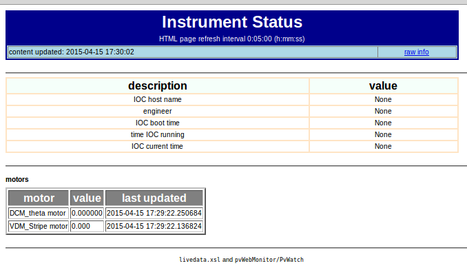

=======================
The `livedata.xsl` file
=======================

The *livedata.xsl* file is used to format select 
monitored EPICS PV values into an HTML file for 
display from the web server.  It is intended that the
user will modify this file for the desired display features.

.. note:: need to provide instructions and references on editing XSLT for displaying PVs.

   
   Example *index.html*, generated from the
   *livedata.xsl* file.
