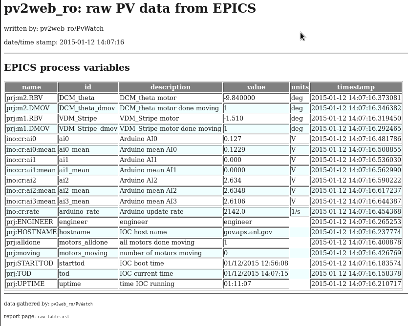

========================
The `raw_table.xsl` file
========================

.. note:: tba

The *raw_table.xsl* file is used to format the complete 
list of monitored EPICS PV values into an HTML file for 
display from the web server.  This system file for the 
*pv2web_ro* project is located in the *pv2web_ro*
package directory. 

   
   Example *raw_report.html*, generated from the
   *raw_table.xsl* file.
