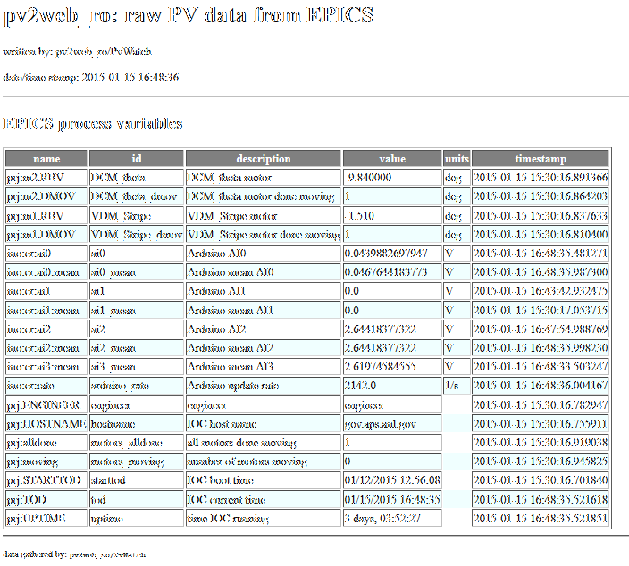

======================
The `rawdata.xsl` file
======================

The *rawdata.xsl* file is used to format the complete 
list of monitored EPICS PV values into an HTML file for 
display from the web server.  It should not be necessary
to edit this file.

   
   Example *rawdata.html*, generated from the
   *rawdata.xsl* file.
