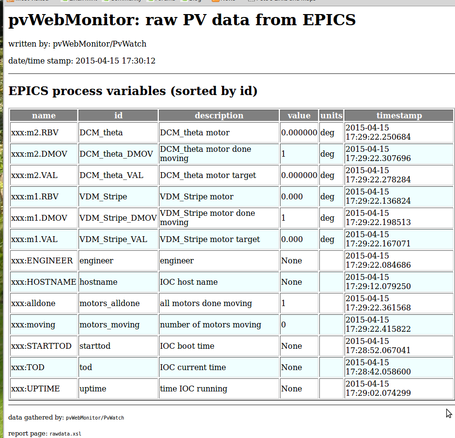

.. _rawdata:

============================
Example Raw Data for Reports
============================

:file: 		<web_site>/rawdata.html
:XSLT:		:download:`rawdata.xsl`
:raw data: 	:download:`rawdata.xml` (:ref:`rawdata`)

.. literalinclude:: rawdata.xml
   :language: guess
   :linenos:

----

   
   Example report of the raw data monitored by an 
   instance of *pvWebMonitor*.

----

(To view an archive copy of this HTML page in your browser, 
click here --> :download:`rawdata.html`)
